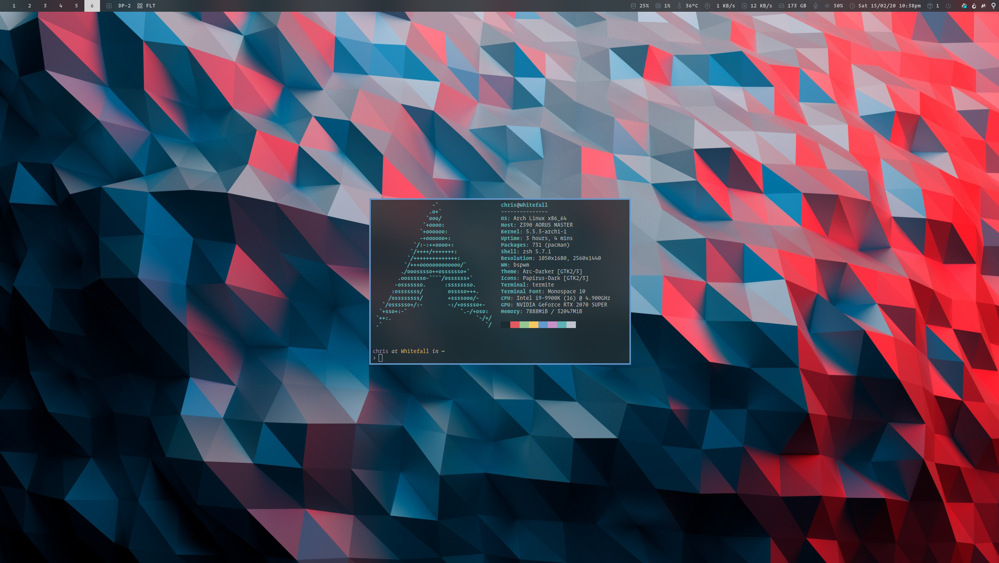

# Dotfiles

These dotfiles setup my terminal and desktop environment.

## Screenshots



## Installation

[GNU Stow](https://www.gnu.org/software/stow/) is used to symlink dotfiles to the home directory. It is recommended you install the packages from `terminal-packages.txt` first, but at minium `stow` is needed, and can be installed with the package manager of your choice.

```sh
git submodule update --init --recursive
yay -Syu $(cat terminal-packages.txt | xargs)
stow terminal
```

The required packages for the desktop environment are listed in `bspwm-desktop-packages.txt`. It is presumed that the terminal dotfile packages have been installed and stowed.

```sh
yay -Syu $(cat bspwm-desktop-packages.txt | xargs)
stow bspwm-desktop
```
